# AgriMitra - AI-Powered Agricultural Assistant

## 🎬 Demo Video
**Watch AgriMitra in Action**: [Demo Video](https://drive.google.com/file/d/1mYbLll04GxqFPIdK6ikDTly1H7rfcY2k/view?usp=sharing) | [Local Demo File](DEMO_Agrimitra.mp4)

AgriMitra is an intelligent agricultural assistant designed to help farmers with crop management, disease diagnosis, market analysis, and government scheme navigation. Built with a voice-first approach, it provides accessible AI-powered assistance for farmers, especially in rural areas.

## � Demo Video

**Watch AgriMitra in Action**: [Demo Video](https://drive.google.com/file/d/1mYbLll04GxqFPIdK6ikDTly1H7rfcY2k/view?usp=sharing)

> **Note**: The same demo video is also available as `DEMO_Agrimitra.mp4` in the repository root.

## �🌾 Project Overview

### Key Features

**🎤 Audio-First Approach**
- **Voice Interface**: Primary interaction through speech-to-text and text-to-speech
- **Multilingual Support**: English and Kannada (easily expandable to other regional languages)
- **Hands-free Operation**: Perfect for farmers working in the field
- **Audio Device Selection**: Choose from multiple microphones for optimal recording

**🔍 Multimodal AI Assistance**
- **Crop Disease Diagnosis**: Upload images of crops to identify diseases, pests, and nutrient deficiencies
- **Text + Image Analysis**: Ask questions about uploaded crop images for detailed analysis
- **Intelligent Recommendations**: Get practical, locally-relevant treatment suggestions
- **Confidence Scoring**: AI provides confidence levels for its diagnoses

**📊 Agricultural Intelligence**
- **Live Crop Prices**: Real-time market data and price trends
- **Market Analysis**: Selling decision support and market insights
- **Stock Information**: Crop availability and demand analysis
- **Government Schemes**: Information about agricultural subsidies and programs

**🌍 Farmer-Centric Design**
- **Local Context**: Specialized knowledge for Karnataka region (expandable)
- **Affordable Solutions**: Focus on locally available and cost-effective treatments
- **Economic Considerations**: Takes into account farmer budget constraints
- **Preventive Measures**: Guidance on preventing future crop issues

### Target Users
- Small-scale farmers in rural areas
- Agricultural extension workers
- Farming communities seeking accessible AI assistance
- Anyone involved in crop management and agricultural decision-making

## 🏗️ Architecture

### System Overview

AgriMitra follows a clean separation between frontend and backend, with the frontend handling user interactions and the backend managing all AI processing through Azure services.

```mermaid
graph TB
    %% User Interface Layer
    subgraph "Frontend (React + TypeScript)"
        UI[User Interface]
        Chat[Chat Interface]
        Voice[Voice Interface]
        Upload[Image Upload]
        Side[Side Panel]
    end
    
    %% API Gateway
    subgraph "Backend (FastAPI + Python)"
        API[FastAPI Router]
        ChatAPI[Chat API]
        SpeechAPI[Speech API]
        MarketAPI[Market API]
        SchemesAPI[Schemes API]
    end
    
    %% Core Services
    subgraph "Core Services"
        LangChain[LangChain Service]
        Config[Configuration]
    end
    
    %% Azure AI Services
    subgraph "Azure AI Platform"
        GPT4[Azure OpenAI GPT-4o]
        STT[Speech-to-Text]
        TTS[Text-to-Speech]
    end
    
    %% Data Sources
    subgraph "Data Sources"
        Market[Market Data API]
        Schemes[Government Schemes DB]
        Knowledge[Agricultural Knowledge]
    end
    
    %% User Interactions
    User([👨‍🌾 Farmer]) --> UI
    
    %% Frontend Components
    UI --> Chat
    UI --> Voice
    UI --> Upload
    UI --> Side
    
    %% API Calls
    Chat -->|HTTP/REST| ChatAPI
    Voice -->|Audio Data| SpeechAPI
    Upload -->|Image Data| ChatAPI
    Side -->|Data Requests| MarketAPI
    Side -->|Scheme Queries| SchemesAPI
    
    %% Backend Processing
    ChatAPI --> LangChain
    SpeechAPI --> STT
    SpeechAPI --> TTS
    MarketAPI --> Market
    SchemesAPI --> Schemes
    
    %% AI Processing
    LangChain --> GPT4
    LangChain --> Knowledge
    
    %% Response Flow
    GPT4 -->|AI Response| LangChain
    LangChain -->|Processed Response| ChatAPI
    STT -->|Transcribed Text| SpeechAPI
    TTS -->|Audio Response| SpeechAPI
    Market -->|Price Data| MarketAPI
    Schemes -->|Scheme Info| SchemesAPI
    
    %% Configuration
    Config --> LangChain
    Config --> SpeechAPI
    
    %% Styling - Light theme with dark text
    classDef frontend fill:#f8f9fa,stroke:#343a40,stroke-width:2px,color:#212529
    classDef backend fill:#ffffff,stroke:#6c757d,stroke-width:2px,color:#212529
    classDef azure fill:#e3f2fd,stroke:#1976d2,stroke-width:2px,color:#0d47a1
    classDef data fill:#f1f8e9,stroke:#388e3c,stroke-width:2px,color:#1b5e20
    classDef user fill:#fff3e0,stroke:#f57c00,stroke-width:3px,color:#e65100
    
    class UI,Chat,Voice,Upload,Side frontend
    class API,ChatAPI,SpeechAPI,MarketAPI,SchemesAPI,LangChain,Config backend
    class GPT4,STT,TTS azure
    class Market,Schemes,Knowledge data
    class User user
```



### Data Flow

1. **Voice Input Flow**
   - User speaks → Voice Interface captures audio → Speech API converts to text → Chat API processes with GPT-4o → Response converted to speech
   
2. **Text Chat Flow**
   - User types message → Chat Interface → Chat API → LangChain Service → GPT-4o → Structured response
   
3. **Image Analysis Flow**
   - User uploads image → Image Upload → Chat API → LangChain Service → GPT-4o multimodal → Disease diagnosis + recommendations
   
4. **Market & Schemes Flow**
   - User requests data → Side Panel → Respective APIs → Mock/Real data sources → Formatted response

### Key Architectural Decisions

- **Frontend-Backend Separation**: Clean API boundaries with no AI logic in frontend
- **Azure-First AI**: All AI processing through Azure OpenAI and Speech services
- **LangChain Integration**: Advanced prompt engineering and conversation management
- **Multimodal Capabilities**: Single GPT-4o model handles both text and image analysis
- **Mock Data Ready**: Easy replacement of mock data with live APIs
- **Scalable Design**: FastAPI async architecture for high performance

## 🔧 Backend Architecture

### Core Services & Technologies

**🤖 AI & Machine Learning**
- **LangChain**: Advanced prompt engineering and conversation management
- **Azure OpenAI GPT-4o**: Multimodal AI for text and image analysis
- **Intelligent Prompting**: Specialized agricultural knowledge base and context-aware responses

**🎙️ Speech Services**
- **Azure Speech-to-Text**: Convert farmer voice input to text with language detection
- **Azure Text-to-Speech**: Natural voice responses in multiple languages
- **Language Support**: English (en-US), Kannada (kn-IN), Hindi (hi-IN), Tamil (ta-IN)

**📡 Data Sources**
- **Market Data API**: Real-time crop prices and market trends *(mock implementation - ready for live data integration)*
- **Government Schemes Database**: Agricultural subsidy and program information *(mock data - can be replaced with official databases)*
- **Crop Disease Knowledge**: Expert agricultural guidance *(expandable with real-world datasets)*

**⚙️ Backend Framework**
- **FastAPI**: High-performance API with automatic documentation
- **Pydantic**: Data validation and settings management
- **Python 3.11+**: Modern Python with async/await support

### Data Integration Notes
> **Important**: Current implementation uses mock data sources for market prices and government schemes. These can be easily swapped with actual APIs and databases:
> - Replace market API endpoints with real commodity exchange data
> - Integrate with official government scheme databases
> - Connect to agricultural research databases for enhanced crop knowledge

## 🎨 Frontend Features & Setup

### Features

**💬 Interactive Chat Interface**
- **Markdown Rendering**: Rich text responses with proper formatting
- **Image Upload**: Drag-and-drop crop image analysis
- **Conversation History**: Maintain context across multiple questions
- **Real-time Responses**: Live updates during AI processing

**🎤 Advanced Voice Interface**
- **Voice Recording**: High-quality audio capture with visual feedback
- **Device Selection**: Choose from available microphones
- **Audio Processing**: Optimized audio format handling for better recognition
- **Voice Playback**: Listen to AI responses in natural speech

**🌐 User Experience**
- **Responsive Design**: Mobile-first approach for field use
- **Multilingual UI**: Interface adapts to selected language
- **Accessibility**: Designed for users with varying technical skills
- **Real-time Feedback**: Visual indicators for all operations

### Setup Instructions

#### Prerequisites
- Node.js 18+ and npm
- Modern web browser with microphone access

#### Installation
```bash
# Navigate to frontend directory
cd frontend

# Install dependencies
npm install

# Start development server
npm run dev

# Build for production
npm run build
```

#### Available Scripts
- `npm run dev` - Start development server (http://localhost:5173)
- `npm run build` - Build for production
- `npm run preview` - Preview production build
- `npm run lint` - Run ESLint for code quality

#### Technology Stack
- **React 18** with TypeScript for type safety
- **Vite** for fast development and building
- **Tailwind CSS** for responsive styling
- **Lucide React** for modern icons
- **React Markdown** for rich text rendering
- **Axios** for API communication

#### Browser Requirements
- **Microphone Permission**: Required for voice features
- **Modern Browser**: Chrome 88+, Firefox 85+, Safari 14+
- **JavaScript Enabled**: Required for all functionality

### Environment Setup
```bash
# Backend environment variables (create .env file)
AZURE_OPENAI_API_KEY=your_azure_openai_api_key
AZURE_OPENAI_ENDPOINT=https://your-resource.openai.azure.com/
AZURE_SPEECH_KEY=your_azure_speech_key
AZURE_SPEECH_REGION=your_azure_region

# Frontend automatically connects to backend at http://localhost:8000
```

## 🚀 Getting Started

1. **Clone the repository**
2. **Set up backend**: Install Python dependencies and configure Azure services
3. **Set up frontend**: Install Node.js dependencies
4. **Configure environment**: Add your Azure API keys
5. **Start services**: Run both backend (FastAPI) and frontend (Vite)
6. **Test voice features**: Ensure microphone permissions are granted
